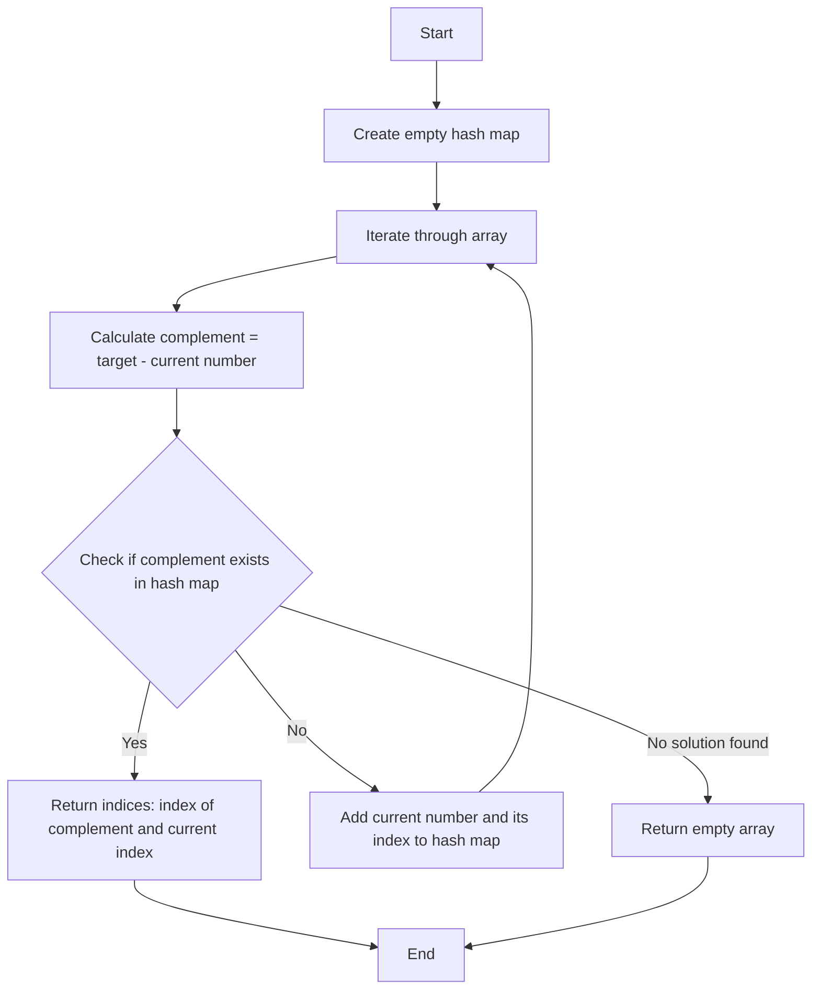

Hi  this is SHYAM K S
---

#  LeetCode Problem Solutions

Welcome to the LeetCode problem solutions repository! My name is Shyam, and in this repository, we will tackle various problems from LeetCode, providing solutions along with detailed explanations. We aim to help you understand the approaches and techniques required to solve these problems effectively.

---

## Easy Problems

  

### 1. <a href="https://leetcode.com/problems/two-sum/description/" target="_blank">Two Sum</a>


  

####  Intuition

The **Two Sum** problem requires finding two numbers in an array that add up to a specific target value and returning their indices.

  

####  Approach

There are a few approaches to solve the Two Sum problem:

  

1.  **Brute Force Approach**:

- This involves checking every possible pair of elements to see if their sum equals the target.

- This method uses nested loops, resulting in a time complexity of O(n^2), where `n` is the number of elements in the array.

  

2.  **Optimized Approach Using Hash Map**:

- Use a hash map (Java's `HashMap`) to store the elements and their indices as we iterate through the array.

- For each element, calculate the complement (target - current element) and check if it exists in the hash map.

- This approach reduces the time complexity to O(n) because hash map operations are average constant time.

  

####  Approach:

1. Create an empty hash map to store elements and their indices.

2. Iterate through the array from left to right.

3. For each element `nums[i]`, calculate the complement by subtracting it from the target: `complement = target - nums[i]`.

4. Check if the complement exists in the hash map. If it does, return the indices of the complement and the current element.

5. If the complement does not exist in the hash map, add the current element and its index to the hash map.

6. Continue until a solution is found or the end of the array is reached.

7. If no solution is found, return an empty array or an appropriate indicator.

  

####  Approach Visualization

  

Here's a visual representation of the optimized approach using a hash map:

  



  

####  Code

  

**Solution 1: Brute Force**

  

```java

import  java.util.ArrayList;

import  java.util.List;

  

class Solution {

public  int[] twoSum(int[] nums, int  target) {

int  n  =  nums.length;

for (int  i  =  0; i < n -  1; i++) {

for (int  j  = i +  1; j < n; j++) {

if (nums[i] + nums[j] == target) {

return  new  int[] {i, j};

}

}

}

return  new  int[0]; // No solution found

}

}

```

  

**Solution 2: Two-pass Hash Map**

  

```java

import  java.util.HashMap;

  

class Solution {

public  int[] twoSum(int[] nums, int  target) {

HashMap<Integer, Integer> numMap  =  new  HashMap<>();

int  n  =  nums.length;

  

// Build the hash map

for (int  i  =  0; i < n; i++) {

numMap.put(nums[i], i);

}

  

// Find the complement

for (int  i  =  0; i < n; i++) {

int  complement  = target - nums[i];

if (numMap.containsKey(complement) &&  numMap.get(complement) != i) {

return  new  int[] {i, numMap.get(complement)};

}

}

  

return  new  int[0]; // No solution found

}

}

```

  

**Solution 3: One-pass Hash Map**

  

```java

import  java.util.HashMap;

  

class Solution {

public  int[] twoSum(int[] nums, int  target) {

HashMap<Integer, Integer> numMap  =  new  HashMap<>();

int  n  =  nums.length;

  

for (int  i  =  0; i < n; i++) {

int  complement  = target - nums[i];

if (numMap.containsKey(complement)) {

return  new  int[] {numMap.get(complement), i};

}

numMap.put(nums[i], i);

}

  

return  new  int[0]; // No solution found

}

}

```
---