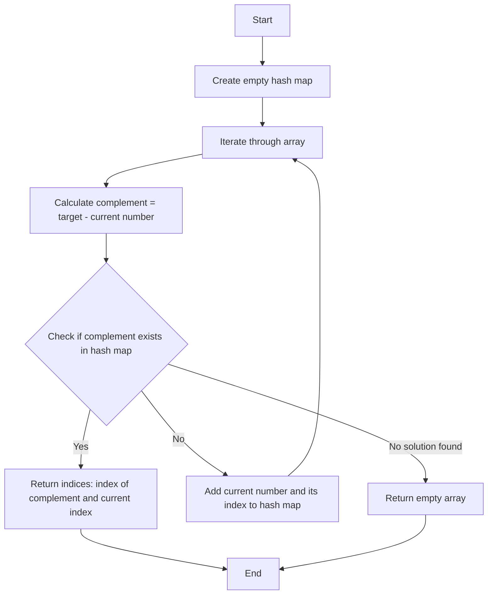
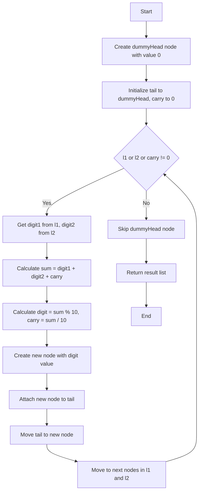
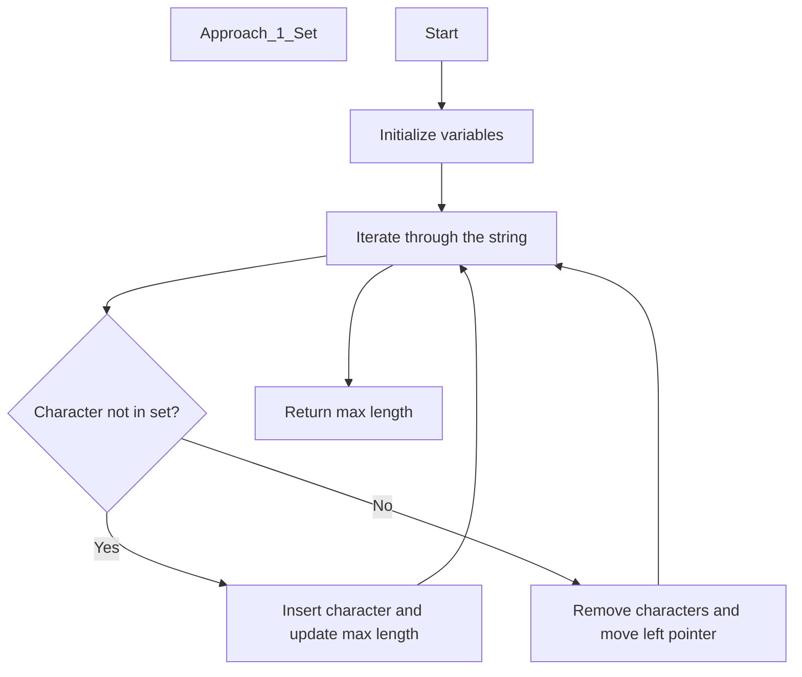
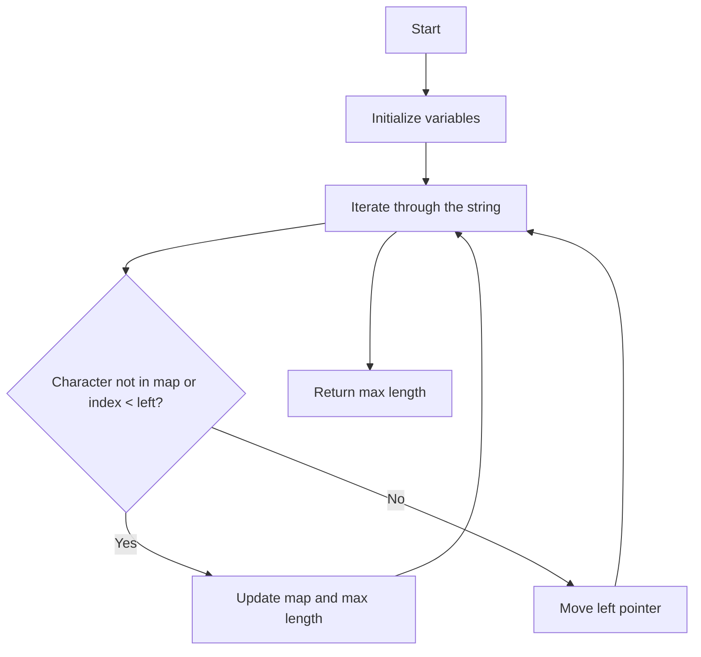
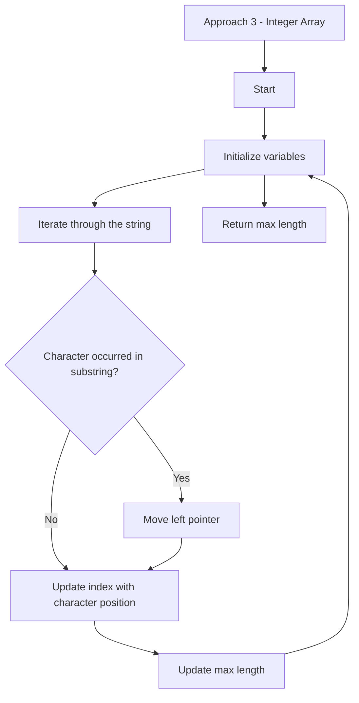

Hi  this is SHYAM K S
---

#  LeetCode Problem Solutions

Welcome to the LeetCode problem solutions repository! My name is Shyam, and in this repository, we will tackle various problems from LeetCode, providing solutions along with detailed explanations. We aim to help you understand the approaches and techniques required to solve these problems effectively.

---


# Table of Contents

✔️ [Easy Problems](#easy-problems)  
- 1 [Two Sum](#two-sum)

✔️ [Medium Problems](#medium-problems)  
- 2 [Add Two Numbers](#add-two-numbers)
- 3 [Longest Substring Without Repeating Characters](#longest-substring-without-repeating-characters)


---
## Easy Problems

### 1. [Two Sum](https://leetcode.com/problems/two-sum/description/)


  

####  Intuition

The **Two Sum** problem requires finding two numbers in an array that add up to a specific target value and returning their indices.

  

####  Approach

There are a few approaches to solve the Two Sum problem:

  

1.  **Brute Force Approach**:

- This involves checking every possible pair of elements to see if their sum equals the target.

- This method uses nested loops, resulting in a time complexity of O(n^2), where `n` is the number of elements in the array.

  

2.  **Optimized Approach Using Hash Map**:

- Use a hash map (Java's `HashMap`) to store the elements and their indices as we iterate through the array.

- For each element, calculate the complement (target - current element) and check if it exists in the hash map.

- This approach reduces the time complexity to O(n) because hash map operations are average constant time.

  

####  Approach:

1. Create an empty hash map to store elements and their indices.

2. Iterate through the array from left to right.

3. For each element `nums[i]`, calculate the complement by subtracting it from the target: `complement = target - nums[i]`.

4. Check if the complement exists in the hash map. If it does, return the indices of the complement and the current element.

5. If the complement does not exist in the hash map, add the current element and its index to the hash map.

6. Continue until a solution is found or the end of the array is reached.

7. If no solution is found, return an empty array or an appropriate indicator.

  

####  Approach Visualization

  

Here's a visual representation of the optimized approach using a hash map:

  



  

####  Code

  

**Solution 1: Brute Force**

  

```java

import  java.util.ArrayList;

import  java.util.List;

  

class Solution {

public  int[] twoSum(int[] nums, int  target) {

int  n  =  nums.length;

for (int  i  =  0; i < n -  1; i++) {

for (int  j  = i +  1; j < n; j++) {

if (nums[i] + nums[j] == target) {

return  new  int[] {i, j};

}

}

}

return  new  int[0]; // No solution found

}

}

```

  

**Solution 2: Two-pass Hash Map**

  

```java

import  java.util.HashMap;

  

class Solution {

public  int[] twoSum(int[] nums, int  target) {

HashMap<Integer, Integer> numMap  =  new  HashMap<>();

int  n  =  nums.length;

  

// Build the hash map

for (int  i  =  0; i < n; i++) {

numMap.put(nums[i], i);

}

  

// Find the complement

for (int  i  =  0; i < n; i++) {

int  complement  = target - nums[i];

if (numMap.containsKey(complement) &&  numMap.get(complement) != i) {

return  new  int[] {i, numMap.get(complement)};

}

}

  

return  new  int[0]; // No solution found

}

}

```

  

**Solution 3: One-pass Hash Map**

  

```java

import  java.util.HashMap;

  

class Solution {

public  int[] twoSum(int[] nums, int  target) {

HashMap<Integer, Integer> numMap  =  new  HashMap<>();

int  n  =  nums.length;

  

for (int  i  =  0; i < n; i++) {

int  complement  = target - nums[i];

if (numMap.containsKey(complement)) {

return  new  int[] {numMap.get(complement), i};

}

numMap.put(nums[i], i);

}

  

return  new  int[0]; // No solution found

}

}

```
---

## Medium Problems

### 2. [Add Two Numbers](https://leetcode.com/problems/add-two-numbers/description/)

### Intuition

The intuition is to iterate through two linked lists representing non-negative integers in reverse order, starting from the least significant digit. We perform digit-wise addition along with a carry value and construct a new linked list to represent the sum. The process continues until both input lists and the carry value are exhausted. The resulting linked list represents the sum of the input numbers in the correct order.

### Explanation

1. **Create a placeholder node** called `dummyHead` with a value of 0. This node will hold the resulting linked list.
2. **Initialize a pointer** called `tail` and set it to `dummyHead`. This pointer will keep track of the last node in the result list.
3. **Initialize a variable** called `carry` to 0. This variable will store the carry value during addition.
4. **Start a loop** that continues until there are no more digits in both input lists (`l1` and `l2`) and there is no remaining carry value.
5. Inside the loop:
   - Check if there is a digit in the current node of `l1`. If it exists, assign its value to a variable called `digit1`. Otherwise, set `digit1` to 0.
   - Check if there is a digit in the current node of `l2`. If it exists, assign its value to a variable called `digit2`. Otherwise, set `digit2` to 0.
   - Add the current digits from `l1` and `l2`, along with the carry value from the previous iteration, and store the sum in a variable called `sum`.
   - Calculate the unit digit of `sum` by taking the modulus (%) of `sum` by 10. This digit will be placed in a new node for the result.
   - Update the `carry` variable by dividing `sum` by 10 and taking the integer division (/) part. This gives us the carry value for the next iteration.
   - Create a new node with the calculated digit as its value.
   - Attach the new node to the `tail` node of the result list.
   - Move the `tail` pointer to the newly added node.
   - Move to the next nodes in both `l1` and `l2`, if they exist. If either list is exhausted, set the corresponding pointer to `null`.
6. After the loop, obtain the actual result list by skipping the `dummyHead` node.
7. Delete the `dummyHead` node.
8. Return the resulting list.

####  Approach Visualization

Here's a visual representation of the process using Mermaid:



### Code

**Java Implementation**

```java
class ListNode {
    int val;
    ListNode next;
    ListNode(int x) { val = x; }
}

class Solution {
    public ListNode addTwoNumbers(ListNode l1, ListNode l2) {
        ListNode dummyHead = new ListNode(0);
        ListNode tail = dummyHead;
        int carry = 0;

        while (l1 != null || l2 != null || carry != 0) {
            int digit1 = (l1 != null) ? l1.val : 0;
            int digit2 = (l2 != null) ? l2.val : 0;

            int sum = digit1 + digit2 + carry;
            int digit = sum % 10;
            carry = sum / 10;

            ListNode newNode = new ListNode(digit);
            tail.next = newNode;
            tail = tail.next;

            l1 = (l1 != null) ? l1.next : null;
            l2 = (l2 != null) ? l2.next : null;
        }

        ListNode result = dummyHead.next;
        return result;
    }
}
```

---


### 3. [Longest Substring Without Repeating Characters](https://leetcode.com/problems/longest-substring-without-repeating-characters/description/)

### Intuition

The intuition behind the 3 solutions is to iteratively find the longest substring without repeating characters by maintaining a sliding window approach. We use two pointers (left and right) to represent the boundaries of the current substring. As we iterate through the string, we update the pointers and adjust the window to accommodate new unique characters and eliminate repeating characters.

###  Approach 

#### **Approach 1 - Set**:
1. We use a set (charSet) to keep track of unique characters in the current substring.
2. We maintain two pointers, left and right, to represent the boundaries of the current substring.
3. The maxLength variable keeps track of the length of the longest substring encountered so far.
4. We iterate through the string using the right pointer.
5. If the current character is not in the set (charSet), it means we have a new unique character.
6. We insert the character into the set and update the maxLength if necessary.
7. If the character is already present in the set, it indicates a repeating character within the current substring.
8. In this case, we move the left pointer forward, removing characters from the set until the repeating character is no longer present.
9. We insert the current character into the set and continue the iteration.
10. Finally, we return the maxLength as the length of the longest substring without repeating characters.

##### Approach Visualization - **Set Based**:



### Code

```java 

```
#### **Approach 2 - Unordered Map**:

1. We improve upon the first solution by using an unordered map (charMap) instead of a set.
2. The map stores characters as keys and their indices as values.
3. We still maintain the left and right pointers and the maxLength variable.
4. We iterate through the string using the right pointer.
5. If the current character is not in the map or its index is less than left, it means it is a new unique character.
6 We update the charMap with the character's index and update the maxLength if necessary.
6. If the character is repeating within the current substring, we move the left pointer to the next position after the last occurrence of the character.
7. We update the index of the current character in the charMap and continue the iteration.
8. At the end, we return the maxLength as the length of the longest substring without repeating characters.

##### Approach Visualization - **Unordered Map**:



### Code

```java
import java.util.HashMap;

class Solution {
    public int lengthOfLongestSubstring(String s) {
        int n = s.length();
        int maxLength = 0;
        HashMap<Character, Integer> charMap = new HashMap<>();
        int left = 0;
        
        for (int right = 0; right < n; right++) {
            if (charMap.containsKey(s.charAt(right)) && charMap.get(s.charAt(right)) >= left) {
                left = charMap.get(s.charAt(right)) + 1;
            }
            charMap.put(s.charAt(right), right);
            maxLength = Math.max(maxLength, right - left + 1);
        }
        
        return maxLength;
    }
}

```

#### **Approach 2 -  Integer Array**:

1. This solution uses an integer array charIndex to store the indices of characters.
2. We eliminate the need for an unordered map by utilizing the array.
3. The maxLength, left, and right pointers are still present.
4. We iterate through the string using the right pointer.
5. We check if the current character has occurred within the current substring by comparing its index in charIndex with left.
6. If the character has occurred, we move the left pointer to the next position after the last occurrence of the character.
7. We update the index of the current character in charIndex.
8. At each step, we update the maxLength by calculating the length of the current substring.
9. We continue the iteration until reaching the end of the string.
10. Finally, we return the maxLength as the length of the longest substring without repeating characters.


##### Approach Visualization - **Integer Array**:



```java
class Solution {
    public int lengthOfLongestSubstring(String s) {
        int n = s.length();
        int maxLength = 0;
        int[] charIndex = new int[128]; // ASCII character set
        int left = 0;
        
        for (int right = 0; right < n; right++) {
            if (charIndex[s.charAt(right)] > left) {
                left = charIndex[s.charAt(right)];
            }
            charIndex[s.charAt(right)] = right + 1;
            maxLength = Math.max(maxLength, right - left + 1);
        }
        
        return maxLength;
    }
}

```